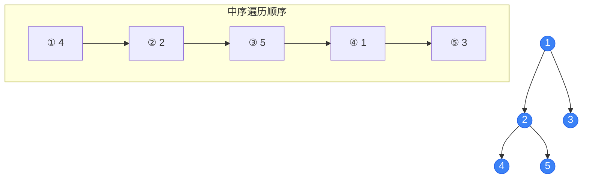
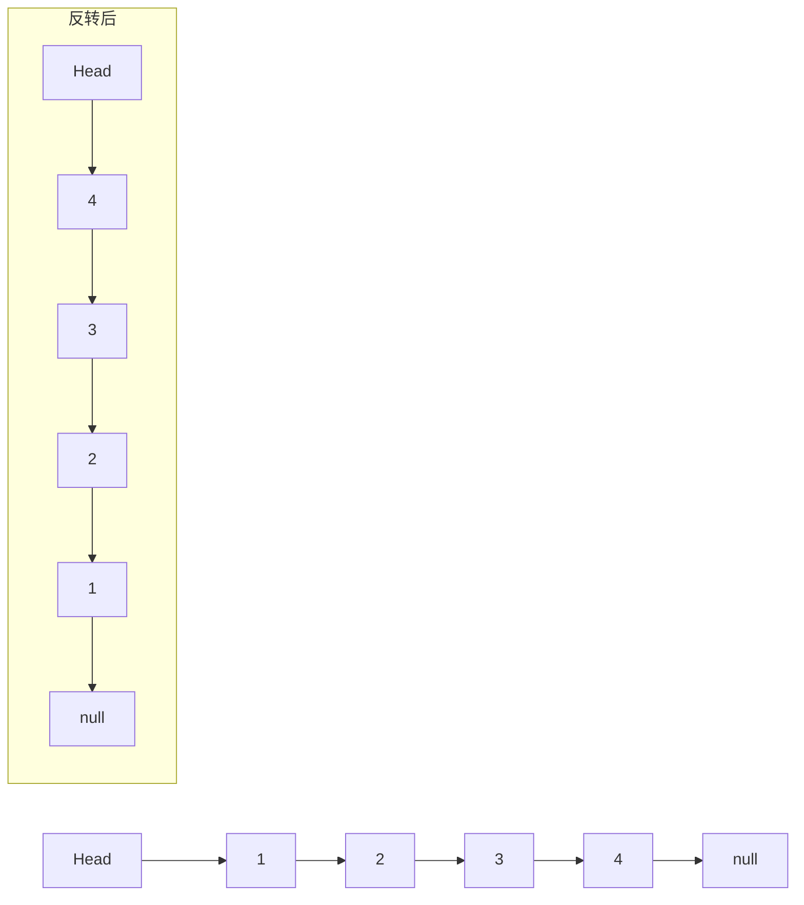

# Kids Coding Coach — 少儿编程辅导老师

> **`SKILL_DIR`** = 本 skill 所在目录（如 `~/.openclaw/skills/kids_coding`）。
> **`TUTOR_DIR`** = tutor skill 目录（如 `~/.openclaw/skills/tutor`）。
> 下文所有脚本命令均以此为基准，使用时替换为实际路径。

---

## 依赖预检（每次执行 skill 前自动运行）

> **执行规则：先运行预检，若有任何项目失败，立即停止并读取 `{SKILL_DIR}/DEPENDENCIES.md` 告知用户如何安装，然后退出。不得跳过预检继续执行。**

```bash
echo "=== Kids Coding Skill 依赖预检 ==="
MISSING=()

command -v manim   >/dev/null 2>&1 || MISSING+=("manim（Linuxbrew）")
command -v ffmpeg  >/dev/null 2>&1 || MISSING+=("ffmpeg（Linuxbrew）")
command -v ffprobe >/dev/null 2>&1 || MISSING+=("ffprobe（Linuxbrew）")
fc-list 2>/dev/null | grep -q "Noto Sans CJK SC" || MISSING+=("Noto Sans CJK SC 字体")
~/.tutor-venv/bin/python -c "import edge_tts" 2>/dev/null || MISSING+=("edge-tts（~/.tutor-venv）")

if [ ${#MISSING[@]} -gt 0 ]; then
  echo "❌ 以下依赖未就绪："
  printf '   - %s\n' "${MISSING[@]}"
  echo ""
  echo "请读取 DEPENDENCIES.md 获取安装指引后重试。"
  exit 1
fi

echo "✅ 所有依赖就绪，继续执行。"
```

**若预检失败**：使用 Read 工具读取 `{SKILL_DIR}/DEPENDENCIES.md`，将缺失项和对应安装命令告知用户，然后停止本次执行，等待用户完成安装后重试。

---

## 工作流程总览

**0. 查重（必须最先执行）** → 1. 获取题目 → 2. 分析题目 → 3. 生成HTML讲解 → 4. 智能归档 + summary.md → 5. 更新CLAUDE.md索引 → 6. 询问视频 → (可选) 7. 分镜脚本 → 8. Manim动画 → 9. 配音音频 → 10. 合成视频

---

## 第零步：查重（收到题目后必须最先执行）

> **严格执行顺序：先查重，再解题。禁止跳过本步骤直接开始分析。**

### 0.1 定位工作区根目录的 CLAUDE.md

```bash
WORKDIR="/home/openclaw/.openclaw/workspace/编程学习"
CLAUDE_MD="$WORKDIR/CLAUDE.md"

if [ ! -f "$CLAUDE_MD" ]; then
  CLAUDE_MD="./编程学习/CLAUDE.md"
fi

if [ -f "$CLAUDE_MD" ]; then
  echo "=== CLAUDE.md 内容 ==="
  cat "$CLAUDE_MD"
else
  echo "CLAUDE.md 不存在，跳过查重，继续第一步。"
fi
```

### 0.2 一级匹配（扫描 CLAUDE.md 关键词）

根据题目的**算法类型**和**关键词**快速扫描各分类条目：

- 若**没有**任何可能匹配的条目 → 直接进入第一步
- 若发现**可能匹配**的条目 → 进入 0.3 二级判断

### 0.3 二级匹配（读取 summary.md）

```bash
cat "$WORKDIR/{分类}/{题目文件夹}/summary.md"
```

**若确认是同一题目** → 直接回复，不再重新解题：

> 这道题我已经讲解过了！
> - 📄 HTML 讲解：`{完整路径}/xxx.html`
> - 🎬 教学视频：`{完整路径}/最终讲解视频.mp4`（如已生成）
>
> 需要我重新讲解或补充什么吗？

**若相似但数据不同** → 说明区别，继续正常流程。

---

## 第一步：获取题目

### 方式 A：网页链接（URL）

用户提供 URL 时，使用 Python 抓取页面内容（支持 LeetCode、洛谷、牛客等常见 OJ）：

```bash
~/.tutor-venv/bin/python3 - <<'PYEOF'
import sys, subprocess

# 确保依赖已安装
try:
    import requests
    from bs4 import BeautifulSoup
except ImportError:
    subprocess.check_call(['pip', 'install', 'requests', 'beautifulsoup4', '-q'])
    import requests
    from bs4 import BeautifulSoup

url = "{{URL}}"   # 替换为实际 URL
headers = {'User-Agent': 'Mozilla/5.0 (compatible; educational-bot/1.0)'}
try:
    resp = requests.get(url, headers=headers, timeout=15)
    soup = BeautifulSoup(resp.text, 'html.parser')
    for tag in soup(['script', 'style', 'nav', 'footer', 'header', 'aside']):
        tag.decompose()
    text = soup.get_text(separator='\n', strip=True)
    print(text[:5000])
except Exception as e:
    print(f'ERROR: {e}')
PYEOF
```

**若抓取失败**（反爬/需登录/超时）→ 提示用户：
> 无法直接访问该链接（可能需要登录或存在防爬保护）。请将题目文字复制粘贴给我。

### 方式 B：文字描述

用户直接提供题目文字，直接进入第二步分析。

### 方式 C：图片

从 inbound 目录读取最新图片，或使用用户提供的路径：

```bash
INBOUND_DIR="/home/openclaw/.openclaw/media/inbound"
IMAGE_PATH=$(ls -t "$INBOUND_DIR"/*.{jpg,jpeg,png,gif} 2>/dev/null | head -1)

if [ -z "$IMAGE_PATH" ]; then
  echo "ERROR: No image found in $INBOUND_DIR"
  exit 1
fi
echo "Using image: $IMAGE_PATH"
```

---

## 第二步：分析题目

### 2.1 识别算法类型（**必须先识别，后续步骤依赖此信息**）

根据题目内容，对照下表识别算法类型：

| 关键词 / 特征 | 算法类型 | 视频模板文件 |
|--------------|---------|------------|
| tree、root、child、left/right child、BST、二叉树、前序/中序/后序遍历、层序遍历、LCA | `binary_tree` | `assets/algorithms/binary_tree.json` |
| linked list、head、next pointer、node、链表、单链表、双链表、头节点、指针遍历、反转链表 | `linked_list` | `assets/algorithms/linked_list.json` |
| binary search、sorted array、折半查找、二分查找、有序数组、upper/lower bound、mid | `binary_search` | `assets/algorithms/binary_search.json` |
| graph、BFS、DFS、vertex、edge、shortest path、Dijkstra、图、广度优先、深度优先、邻接表 | `graph` | `assets/algorithms/graph.json` |
| sort、bubble、selection、insertion、排序、冒泡、选择排序、插入排序 | `sorting` | `assets/algorithms/sorting.json` |
| array、string、数组、字符串、双指针、滑动窗口（无特定数据结构） | `array_basic` | 通用模板（仅 HTML，暂不生成视频） |

**若题目含多种算法**（如"用 BFS 遍历二叉树"）→ 以**主要数据结构**为准（此例：`binary_tree`）。

**若算法类型不在上表**（如动态规划、贪心等高阶算法）→ 告知用户：
> 当前版本暂不支持该算法类型的动画视频，仅生成 HTML 讲解文档。未来版本将支持更多算法。

### 2.2 提取题目结构化信息

分析后输出以下 JSON（用于后续 storyboard 和 HTML 生成）：

```json
{
  "algorithm_type": "binary_tree",
  "title": "二叉树中序遍历",
  "difficulty": "基础",
  "problem_description": "给定一个二叉树的根节点，返回其中序遍历结果",
  "data_structure": {
    "type": "binary_tree",
    "node_count": 5,
    "structure": "完全二叉树",
    "node_ids": ["A(1)", "B(2)", "C(3)", "D(4)", "E(5)"],
    "edges": [["A","B"],["A","C"],["B","D"],["B","E"]]
  },
  "operation": "inorder_traversal",
  "input_example": "[1, 2, 3, 4, 5]",
  "output_example": "[4, 2, 5, 1, 3]",
  "constraints": ["节点数 1~100", "节点值 0~100"],
  "key_steps": [
    "从根节点出发，优先走左子树",
    "到达最左叶子节点时开始访问",
    "访问顺序：左子树 → 当前节点 → 右子树"
  ],
  "time_complexity": "O(n)",
  "space_complexity": "O(h)（h 为树高）",
  "coords": {
    "root": [0, 2, 0],
    "B": [-2, 0.5, 0],
    "C": [2, 0.5, 0],
    "D": [-3, -1, 0],
    "E": [-1, -1, 0]
  }
}
```

---

## 第三步：生成HTML讲解文档

生成包含**流程图 + 解题步骤 + 参考代码**的 HTML 文件，填充对应占位符后保存。

### 占位符列表

| 占位符 | 说明 |
|--------|------|
| `{{算法类型}}` | 二叉树/链表/二分查找等 |
| `{{难度}}` | 入门/基础/进阶 |
| `{{题目标题}}` | 简洁题目名称 |
| `{{日期}}` | YYYYMMDD |
| `{{知识点标签}}` | 逗号分隔 |
| `{{题目内容}}` | 原题文字（含示例输入输出） |
| `{{Mermaid流程图}}` | Mermaid.js 代码（见下方规则） |
| `{{解题步骤}}` | `<div class="step">` 列表 |
| `{{参考代码}}` | Python/JavaScript 代码块 |
| `{{时间复杂度}}` | O(n) 等 |
| `{{空间复杂度}}` | O(h) 等 |
| `{{关键思路}}` | `<div class="insight">` 块 |

### Mermaid 流程图规则

**根据算法类型选择图类型：**

| 算法类型 | Mermaid 图类型 | 说明 |
|---------|--------------|------|
| 二叉树遍历/操作 | `graph TD` | 树形自上而下，圆形节点 |
| 链表操作 | `graph LR` | 左右方向，方形节点，箭头表示 next |
| 二分查找 | `flowchart TD` | 含菱形判断框的算法流程 |
| 图 BFS/DFS/Dijkstra | `graph TD` | 原图拓扑结构 + 算法流程子图 |
| 排序 | `flowchart TD` | 循环+比较+交换的逻辑流程 |

**节点样式类（所有图通用）：**
```
classDef current fill:#f59e0b,stroke:#d97706,color:#000
classDef visited fill:#3b82f6,stroke:#2563eb,color:#fff
classDef result fill:#10b981,stroke:#059669,color:#fff
classDef default_node fill:#1e3a5f,stroke:#3b82f6,color:#fff
```

**示例 1 — 二叉树中序遍历：**


**示例 2 — 二分查找流程：**
```mermaid
flowchart TD
    A[初始化 left=0, right=n-1] --> B{left <= right?}
    B -- 是 --> C[mid = left+right // 2]
    C --> D{arr[mid] == target?}
    D -- 等于 --> E[✅ 找到！返回 mid]:::result
    D -- 小于 --> F[left = mid + 1]
    D -- 大于 --> G[right = mid - 1]
    F --> B
    G --> B
    B -- 否 --> H[❌ 未找到，返回 -1]
    classDef result fill:#10b981,stroke:#059669,color:#fff
```

**示例 3 — 链表反转（LR 方向）：**


### 解题步骤 HTML 模板

```html
<div class="step">
  <div class="step-number"></div>
  <div class="step-content">
    <div class="step-title">步骤标题</div>
    <div class="step-body">说明文字，支持 $行内公式$ 和 $$块级公式$$</div>
    <div class="step-code">
      <pre><code class="language-python">
# 示例代码片段
def traverse(node):
    if node is None:
        return
      </code></pre>
    </div>
  </div>
</div>
```

### 关键思路 HTML 模板

```html
<div class="insight">
  <span class="insight-icon">💡</span>
  <span>核心思路：中序遍历 = 左→根→右。时间复杂度 O(n)，空间复杂度 O(h)。</span>
</div>
```

**文件命名规则：**
```
{算法类型}_{YYYYMMDD}_{简要描述}.html
```
示例：`binary_tree_20260223_inorder_traversal.html`、`binary_search_20260223_find_target.html`

---

## 第四步：智能归档（分类目录 + 题目文件夹）

### 4.1 确定工作区根目录

```bash
OPENCLAW_WORKSPACE="/home/openclaw/.openclaw/workspace"
if [ -d "$OPENCLAW_WORKSPACE" ]; then
  mkdir -p "$OPENCLAW_WORKSPACE/编程学习"
  WORKDIR="$OPENCLAW_WORKSPACE/编程学习"
  echo "✓ 使用 OpenClaw 工作目录：$WORKDIR"
fi
```

若 workspace 目录不存在，参照 tutor skill 第三步的常规判断逻辑，将根目录命名为 `编程学习/`。

### 4.2 创建分类目录和题目文件夹

按算法类型分类，同时创建中间文件子目录 `_work/`：

```bash
mkdir -p {工作区根目录}/{分类目录}/{题目文件夹名}/_work
```

**算法类型 → 目录名 映射：**

| algorithm_type | 目录名 |
|---------------|-------|
| binary_tree | 二叉树 |
| linked_list | 链表 |
| binary_search | 二分查找 |
| graph | 图 |
| sorting | 排序 |
| array_basic | 数组与字符串 |

示例：
```bash
mkdir -p 编程学习/二叉树/binary_tree_20260223_inorder_traversal/_work
```

### 4.3 文件归属规则

**题目文件夹根**（永久保留）：

| 文件 | 说明 |
|------|------|
| `{题目名}.html` | HTML 讲解文档（含流程图） |
| `storyboard.json` | 分镜脚本（视频成功后唯一保留的中间产物） |
| `summary.md` | 题目摘要（查重用） |
| `最终讲解视频.mp4` | 最终视频（如已生成） |

**`_work/` 子目录**（视频成功后整体删除）：

| 文件/目录 | 说明 |
|-----------|------|
| `narration.json` | 配音文本列表（id + text） |
| `TutorScene.py` | Manim 动画脚本 |
| `audio/` | 各段 mp3 + combined.mp3 |
| `media/` | Manim 渲染输出 |

### 4.4 生成题目摘要（summary.md）

```markdown
# 题目摘要

- **科目**：编程/算法
- **算法类型**：二叉树 - 中序遍历
- **题目描述**：给定二叉树的根节点，返回其中序遍历结果
- **示例输入**：[1, null, 2, 3]
- **示例输出**：[1, 3, 2]
- **时间复杂度**：O(n)
- **关键词**：二叉树, 中序遍历, DFS, 递归, 左根右
- **输出文件**：
  - HTML：`binary_tree_20260223_inorder_traversal.html`
  - 视频：（如已生成，填写 `最终讲解视频.mp4`）
```

---

## 第五步：创建/更新 CLAUDE.md 索引

在**工作区根目录**下维护 `CLAUDE.md`：

```markdown
# 编程学习索引

> 此文件由少儿编程辅导技能自动维护。
> 格式：题目名称 `[关键词, ...]` → `路径/` (日期)

## 二叉树

- 中序遍历 `[二叉树, 中序遍历, DFS, 递归]` → `二叉树/binary_tree_20260223_inorder_traversal/` (2026-02-23)

## 链表

（暂无）

## 二分查找

（暂无）

## 图

（暂无）

## 排序

（暂无）

## 数组与字符串

（暂无）
```

**已有 CLAUDE.md 时**，读取后在对应分类末尾追加新条目：
```markdown
- {题目简要描述} `[关键词1, 关键词2, ...]` → `{分类}/{题目文件夹名}/` ({YYYY-MM-DD})
```

---

## 第六步：询问视频讲解

HTML 保存完成后，向学生询问：

> 我已经为你生成了HTML讲解文档（含解题流程图），保存在 `{完整路径}`。
> 是否需要我制作一个**算法动画视频**？视频会动态展示每一步的节点状态变化，并配有语音讲解。

**若算法类型不支持视频**（array_basic 或不在支持列表中）：
> 当前版本暂不支持该算法类型的动画视频，仅提供 HTML 讲解文档。

---

## 第七步：设计视频分镜脚本

> **注意：分镜脚本是 AI 内部规划文档，不展示给学生。**
>
> **格式参考**：`{SKILL_DIR}/assets/narration_template.json`（通用基础模板）以及 `{SKILL_DIR}/assets/algorithms/{algorithm_type}.json`（算法专属模板，**必须读取对应模板作为参考**）。

### 分镜总体规则

- **固定 7 段结构**，segment id 固定顺序：`intro → problem → draw → operation_1 → operation_2 → result → summary`
- 每段含 `type`、`duration_hint_s`、`narration`、`visual` 四个核心字段
- **每段 narration 字符数 × 0.12 秒 ≈ 音频时长**，据此设置 `duration_hint_s`
- **全部用 `Text(font=FONT)` 渲染文字，禁止使用 `MathTex`**
- `self.wait()` = 音频时长 - 本段所有 run_time 之和
- 面向小学生的旁白风格：口语化、亲切，每段不超过 60 字

### 节点状态颜色约定（所有算法通用）

```
C_NODE_DEFAULT  = "#1e3a5f"   # 默认节点（深蓝）
C_NODE_CURRENT  = "#f59e0b"   # 当前处理节点（琥珀）—— 正在看这里！
C_NODE_VISITED  = "#3b82f6"   # 已访问节点（亮蓝）—— 已经处理过
C_NODE_RESULT   = "#10b981"   # 结果节点（绿）—— 找到了/排好了
C_EDGE_DEFAULT  = "#64748b"   # 默认边/指针（灰）
C_EDGE_ACTIVE   = "#f59e0b"   # 当前活跃边/指针（琥珀）
C_RANGE_L       = "#818cf8"   # 二分：左半已排除（紫）
C_RANGE_R       = "#f87171"   # 二分：右半已排除（红）
C_RANGE_MID     = "#34d399"   # 二分：当前中间元素（绿）
C_SORT_CMP      = "#f59e0b"   # 排序：正在比较的元素（琥珀）
C_SORT_SWAP     = "#ef4444"   # 排序：被交换的元素（红）
C_SORT_DONE     = "#10b981"   # 排序：已排好序（绿）
```

---

### 7A. 二叉树（binary_tree）分镜模板

> **读取模板**：`{SKILL_DIR}/assets/algorithms/binary_tree.json`

**7 段结构：**

| segment_no | id | type | 内容要点 |
|-----------|-----|------|---------|
| 1 | `intro` | `title_card` | 算法名（如"中序遍历"）+ 口诀（"左→根→右"） |
| 2 | `problem` | `text_card` | 完整题目：树结构、已知条件、求什么 |
| 3 | `draw` | `tree_draw` | 逐步 Create 出树结构；节点 `Circle(r=0.35)` + `Text(val)`；颜色 C_NODE_DEFAULT；存入 `self._tree` |
| 4 | `operation_1` | `tree_traverse_start` | 高亮起始节点变 C_NODE_CURRENT；显示"从根节点开始"说明；初始化遍历方向指示 |
| 5 | `operation_2` | `tree_traverse_steps` | 逐节点：当前→C_NODE_CURRENT（Indicate 脉冲）→访问→C_NODE_VISITED（旁边标顺序编号①②③）；回溯时显示虚线箭头（C_EDGE_ACTIVE→灰）|
| 6 | `result` | `tree_result` | 所有节点变 C_NODE_RESULT；底部 FadeIn 结果数组 `[v1, v2, ...]` |
| 7 | `summary` | `answer_reveal` | 大号结果 + 💡口诀说明 |

**动画约定：**
- 节点位置由题目坐标（`coords` 字段）确定，水平间距 ≈1.5，垂直间距 ≈1.2 Manim 单位
- 状态切换：`.animate.set_fill(C_NODE_CURRENT).set_stroke(C_EDGE_ACTIVE)` + `Indicate(node, scale_factor=1.3)`
- 访问顺序编号：`Text("①", font_size=18, color=C_AMBER_STK)` 放在节点右上角 `+np.array([0.3,0.3,0])`
- 回溯虚线：`DashedLine(child_pos, parent_pos, color="#94a3b8", dash_length=0.12)`
- 所有对象存入 `self._tree_nodes`（dict: id→VGroup）和 `self._tree_edges`（list of Line）

---

### 7B. 链表（linked_list）分镜模板

> **读取模板**：`{SKILL_DIR}/assets/algorithms/linked_list.json`

**7 段结构：**

| segment_no | id | type | 内容要点 |
|-----------|-----|------|---------|
| 1 | `intro` | `title_card` | 算法名（如"链表反转"）+ 一句话描述 |
| 2 | `problem` | `text_card` | 链表结构 + 输入输出示例 |
| 3 | `draw` | `list_draw` | 从左到右 Create 链表：`RoundedRectangle(0.8×0.6)` + 值 + `Arrow` 连接；`head↓` 标签指向头节点；`null` 标识尾部；存入 `self._list_nodes`、`self._list_arrows` |
| 4 | `operation_1` | `list_pointer_init` | 初始化操作指针（`prev=None`、`curr=head` 等）；彩色 `Arrow↓` 从节点上方指向节点 + `Text(指针名)` 标注；颜色 C_POINTER |
| 5 | `operation_2` | `list_pointer_steps` | 每步：curr节点→C_NODE_CURRENT；移动指针（`Arrow.animate.shift(RIGHT*1.4)`）；插入/删除时旧箭头 `FadeOut` + 新箭头 `Create` |
| 6 | `result` | `list_result` | 显示操作后链表新状态；已删节点淡灰或 `FadeOut` |
| 7 | `summary` | `answer_reveal` | 总结操作步骤 + 💡关键规则 |

**动画约定：**
- 节点宽0.8高0.6，节点间距1.4 Manim 单位，整体横向居中
- 指针箭头：`Arrow(UP*0.6, DOWN*0.1, color=C_POINTER, max_tip_length_to_length_ratio=0.3)`，指针标签在箭头上方
- 插入节点：新节点 `FadeIn`（从上方 `shift=DOWN*0.5`），然后旧箭头 `ReplacementTransform`/`FadeOut + Create`
- 删除节点：节点及其两侧箭头 `FadeOut`，新连接箭头 `Create`

---

### 7C. 二分查找（binary_search）分镜模板

> **读取模板**：`{SKILL_DIR}/assets/algorithms/binary_search.json`

**7 段结构：**

| segment_no | id | type | 内容要点 |
|-----------|-----|------|---------|
| 1 | `intro` | `title_card` | "二分查找" + "每次缩小一半范围！" |
| 2 | `problem` | `text_card` | 有序数组 + 目标值 target |
| 3 | `draw` | `array_draw` | 水平排列数组：`Square(0.7)` + 值 + 下方索引标签；颜色 C_NODE_DEFAULT；存入 `self._cells` |
| 4 | `operation_1` | `bisect_init` | `left↑` 和 `right↑` 箭头分别指向 index=0、n-1；计算 `mid=(l+r)//2`；mid 格变 C_RANGE_MID（绿）；显示"mid 是中间格" |
| 5 | `operation_2` | `bisect_step` | 比较 arr[mid] vs target → 箭头标大小符号 → 更新 left/right → 已排除侧盖半透明遮罩（`Rectangle` fill_opacity=0.45，左侧 C_RANGE_L，右侧 C_RANGE_R）→ 新 mid 变绿 |
| 6 | `result` | `bisect_result` | **找到**：目标格变 C_NODE_RESULT，显示"返回索引 X"；**未找到**：left>right 交叉，显示"未找到" |
| 7 | `summary` | `answer_reveal` | 结果 + 💡"每次排除一半，O(log n)，比逐个找快多了！" |

**动画约定：**
- 数组格：`VGroup(Square(0.7), Text(val, font_size=20))` 水平排列，间距0；每格下方 `Text(str(i), font_size=14, color="#64748b")`
- left/right/mid 指针：`Arrow(DOWN*0.2, UP*0.1, color=C_POINTER)` 从格子下方向上 + `Text(name, font_size=16)`
- 范围遮罩：`Rectangle(width=N*0.7, height=0.7, fill_color=C_RANGE_L, fill_opacity=0.45, stroke_width=0)`，`Align` 到对应格子范围上方

---

### 7D. 图 BFS/DFS/Dijkstra（graph）分镜模板

> **读取模板**：`{SKILL_DIR}/assets/algorithms/graph.json`

**7 段结构：**

| segment_no | id | type | 内容要点 |
|-----------|-----|------|---------|
| 1 | `intro` | `title_card` | BFS："广度优先，一圈一圈往外扩"；DFS："深度优先，一条路走到底"；Dijkstra："找最短路，每次选最近的点" |
| 2 | `problem` | `text_card` | 图结构（节点数/边数/权重）+ 问题（遍历顺序/最短路） |
| 3 | `draw` | `graph_draw` | 画出图结构：`Circle(r=0.4)` + 节点编号；`Arrow`（有向）或 `Line`（无向）；权重 `Text(w)` 放在边中点旁；存入 `self._graph_nodes`、`self._graph_edges` |
| 4 | `operation_1` | `graph_algo_init` | 高亮起点→C_NODE_CURRENT；右侧显示初始数据结构（BFS：队列框 `[start]`；DFS：栈框 `[start]`；Dijkstra：距离表 `{A:0, B:∞, ...}`） |
| 5 | `operation_2` | `graph_algo_steps` | **BFS**：按层波浪扩展，同层节点同时 Indicate + 变 C_NODE_VISITED，队列框动态更新。**DFS**：沿路径深入，当前边→C_EDGE_ACTIVE（琥珀）→回溯后变 `#94a3b8`（灰）。**Dijkstra**：每步高亮最小距离节点→松弛邻边→更新距离表 |
| 6 | `result` | `graph_result` | 所有节点变 C_NODE_VISITED 或 C_NODE_RESULT；显示访问序列（BFS/DFS）或最短路径（Dijkstra） |
| 7 | `summary` | `answer_reveal` | 结果 + 时间复杂度 O(V+E) + 💡口诀 |

**动画约定：**
- 节点：`Circle(radius=0.4, fill_color=C_NODE_DEFAULT, stroke_color=C_NODE_BORDER)` + `Text(id, font_size=20)`
- 数据结构框（右侧）：`RoundedRectangle` + 动态 `Text` 列表，每步 `Transform`/`FadeOut+FadeIn`
- BFS 波浪：`AnimationGroup([Indicate(n, color=C_NODE_CURRENT, scale_factor=1.3) for n in level], lag_ratio=0.2)`
- Dijkstra 距离表：`VGroup` of `Text` 行，更新时对应行 `FadeOut+FadeIn`，最短路径边最终变 C_NODE_RESULT

---

### 7E. 排序（sorting）分镜模板

> **读取模板**：`{SKILL_DIR}/assets/algorithms/sorting.json`

**7 段结构：**

| segment_no | id | type | 内容要点 |
|-----------|-----|------|---------|
| 1 | `intro` | `title_card` | 算法名 + 口诀（冒泡："大的往后冒"；选择："找最小放前面"；插入："摸牌往左插"） |
| 2 | `problem` | `text_card` | 初始数组 + 排序目标（从小到大/从大到小） |
| 3 | `draw` | `array_draw` | 水平排列数组格（`Square(0.7)` + 值）；颜色 C_NODE_DEFAULT；存入 `self._cells` |
| 4 | `operation_1` | `sort_first_pass` | 第一轮完整演示：逐对高亮（同时变 C_SORT_CMP 琥珀）→ 需要交换时变 C_SORT_SWAP（红）→ 交换动画（位置互换）→ 轮末已排好的格变 C_SORT_DONE（绿） |
| 5 | `operation_2` | `sort_more_passes` | 第二轮（可加速 run_time 缩短）；已排好的格不再参与比较；底部显示"第 N 轮" |
| 6 | `result` | `sort_result` | 全部格变 C_SORT_DONE；显示已排序数组 |
| 7 | `summary` | `answer_reveal` | 总轮数/比较次数 + 时间复杂度 O(n²) + 💡口诀 |

**排序类型细化：**

| 算法 | 第4段重点 | 第5段重点 |
|------|---------|---------|
| 冒泡排序 | 相邻比较，大数后移，末尾固定 | 继续多轮，已排序区右侧扩大 |
| 选择排序 | 扫描全部找最小值（指针箭头从左到右），与首位交换 | 最小值位置右移，继续找次小 |
| 插入排序 | 取出第2个元素，与左侧比较后插入 | 继续取出后续元素逐一插入 |

**动画约定：**
- 交换：`self.play(a_cell.animate.shift(RIGHT*0.7), b_cell.animate.shift(LEFT*0.7))`，同时交换在 `self._cells` 列表中的引用
- 已排序区：右侧已排好格的背景换为淡绿色 `Rectangle(fill_color="#064e3b", fill_opacity=0.3)`
- 比较符号：`Text(">", font_size=24, color=C_SORT_CMP)` 显示在两格之间上方，比较结束 `FadeOut`

### 生成 narration.json

从 storyboard.json 各段提取 `narration` 字段，生成 `_work/narration.json`（供 generate_audio.py 使用，只需 `id` + `text`）：

```json
[
  {"id": "intro",       "text": "算法名称口诀引入..."},
  {"id": "problem",     "text": "完整朗读题目..."},
  {"id": "draw",        "text": "描述数据结构图形..."},
  {"id": "operation_1", "text": "描述起始操作..."},
  {"id": "operation_2", "text": "描述逐步演示..."},
  {"id": "result",      "text": "描述结果..."},
  {"id": "summary",     "text": "总结答案和关键规则..."}
]
```

---

## 第八步：用 Manim 生成动画

> **模板文件**：
> - `{SKILL_DIR}/assets/TutorScene_template.py` — 含全部算法的节点/边/数组绘制 helper 方法、颜色常量、7 个 segment 方法骨架、FILL_IN 占位符
> - `{SKILL_DIR}/assets/LLM_PROMPT_GUIDE.md` — 算法视频生成三步工作流，适用于 Kimi 2.5 等弱 LLM

### 8.1 生成 Manim 脚本

**方式 A（推荐）：读取算法模板填写**

1. 读取 `{SKILL_DIR}/assets/algorithms/{algorithm_type}.json` 对应模板
2. 读取 `{SKILL_DIR}/assets/TutorScene_template.py` 骨架
3. 按 `{SKILL_DIR}/assets/LLM_PROMPT_GUIDE.md` 三步流程，将题目信息填入所有 `FILL_IN` 占位符
4. 保存到 `_work/TutorScene.py`

> **关键约束（全部算法通用）**：
> - 全部用 `Text(font=FONT)` 渲染文字，**禁止 `MathTex`**（中文字体不兼容）
> - 禁止 `Transform()`，用 `FadeOut + FadeIn` 替代
> - `self.wait()` = 音频时长 - 本段所有 run_time 之和
> - 所有节点对象存入对应 `self._xxx` 属性（`self._tree_nodes`、`self._list_nodes`、`self._cells` 等）供后续段使用
> - 节点状态切换：`.animate.set_fill(color).set_stroke(color)`

### 8.2 渲染动画

> **Raspberry Pi OS Lite**：统一去掉 `-p` flag（无桌面环境），使用 `--media_dir` 重定向输出。

```bash
# 快速验证（480p）
manim -ql --media_dir _work/media _work/TutorScene.py TutorScene

# 正式渲染（720p）
manim -qm --media_dir _work/media _work/TutorScene.py TutorScene
```

### 8.3 渲染完成验证（**必须执行，禁止跳过**）

```bash
MANIM_VIDEO=$(find _work/media/videos/TutorScene -name "TutorScene.mp4" 2>/dev/null | sort | tail -1)

if [ -z "$MANIM_VIDEO" ]; then
  echo "❌ 错误：未找到 Manim 输出视频！"
  echo "常见原因：字体缺失、Python 语法错误、对象未定义、动画对象被重复 FadeOut"
  exit 1
fi

SIZE=$(du -k "$MANIM_VIDEO" | cut -f1)
if [ "$SIZE" -lt 10 ]; then
  echo "❌ 错误：视频文件过小（${SIZE}KB），可能是空文件或渲染失败"
  exit 1
fi

echo "✅ Manim 视频验证通过：$MANIM_VIDEO（${SIZE}KB）"
export MANIM_VIDEO_PATH="$MANIM_VIDEO"
```

---

## 第九步：用 edge-tts 生成配音音频

> **复用 tutor skill 脚本，共享 `~/.tutor-venv`，无需重新安装依赖。**

```bash
python3 {TUTOR_DIR}/scripts/generate_audio.py _work/narration.json _work/audio/
```

**音频验证：**

```bash
echo "=== 音频文件检查 ==="
ls -lh _work/audio/*.mp3 2>/dev/null || { echo "❌ 未找到音频文件！"; exit 1; }
[ -s "_work/audio/combined.mp3" ] || { echo "❌ combined.mp3 不存在或为空！"; exit 1; }
AUDIO_SIZE=$(du -k _work/audio/combined.mp3 | cut -f1)
echo "✅ 合并音频验证通过（${AUDIO_SIZE}KB）"
```

---

## 第十步：合成教学视频

### 10.1 探测路径并合成

```bash
MANIM_VIDEO=$(find _work/media/videos/TutorScene -name "TutorScene.mp4" 2>/dev/null | sort | tail -1)
COMBINED_AUDIO="_work/audio/combined.mp3"

[ -s "$MANIM_VIDEO" ]    || { echo "❌ Manim 视频不存在！请先完成第八步渲染。"; exit 1; }
[ -s "$COMBINED_AUDIO" ] || { echo "❌ 合并音频不存在！请先完成第九步配音。"; exit 1; }

echo "视频时长：$(ffprobe -v error -show_entries format=duration -of csv=p=0 "$MANIM_VIDEO")秒"
echo "音频时长：$(ffprobe -v error -show_entries format=duration -of csv=p=0 "$COMBINED_AUDIO")秒"

ffmpeg -y \
       -i "$MANIM_VIDEO" \
       -i "$COMBINED_AUDIO" \
       -map 0:v -map 1:a \
       -c:v libx264 -preset fast -crf 23 \
       -c:a aac -b:a 128k \
       -shortest \
       最终讲解视频.mp4
```

### 10.2 合成结果验证与收尾

```bash
FINAL_OK=true

if [ ! -s "最终讲解视频.mp4" ]; then
  echo "❌ 错误：最终讲解视频.mp4 不存在或为空！"
  FINAL_OK=false
fi

if $FINAL_OK; then
  HAS_VIDEO=$(ffprobe -v error -select_streams v -show_entries stream=codec_type -of csv=p=0 "最终讲解视频.mp4")
  HAS_AUDIO=$(ffprobe -v error -select_streams a -show_entries stream=codec_type -of csv=p=0 "最终讲解视频.mp4")
  [ "$HAS_VIDEO" = "video" ] || { echo "⚠ 警告：视频流缺失！"; FINAL_OK=false; }
  [ "$HAS_AUDIO" = "audio" ] || { echo "⚠ 警告：音频流缺失！"; FINAL_OK=false; }
fi
```

**若成功：**

```bash
if $FINAL_OK; then
  FINAL_SIZE=$(du -m "最终讲解视频.mp4" | cut -f1)
  echo "✅ 视频合成成功！大小：${FINAL_SIZE}MB"
  rm -rf _work/
  # 更新 summary.md 视频字段：- 视频：`最终讲解视频.mp4`
fi
```

**成功后告知学生：**
> ✅ 视频已生成：`最终讲解视频.mp4`（{FINAL_SIZE}MB）
> 可用任意播放器观看。
>
> 题目文件夹保留：
> - `{题目名}.html`（流程图讲解）
> - `storyboard.json`
> - `summary.md`
> - `最终讲解视频.mp4`

**若失败**：保留 `_work/` 中间文件，询问学生是否删除整个题目文件夹（同 tutor skill 失败路径）。

---

## 依赖速查

> 详细安装说明见 `{SKILL_DIR}/DEPENDENCIES.md`。

| 工具 | 用途 |
|------|------|
| `manim` | 算法动画渲染 |
| `ffmpeg / ffprobe` | 音视频合成（需 brew 版，含 libx264） |
| `edge-tts` | 中文配音（共享 tutor skill 的 `~/.tutor-venv`） |
| Noto Sans CJK SC | Manim 中文字体 |
| `requests + bs4` | URL 题目抓取（安装于 `~/.tutor-venv`） |

## 文件结构参考

```
{工作区根目录}/                              # 如 编程学习/
├── CLAUDE.md                                # 题目分类索引
├── 二叉树/
│   └── binary_tree_20260223_inorder/
│       ├── binary_tree_20260223_inorder.html  # HTML 讲解（含流程图）
│       ├── storyboard.json                    # 分镜脚本
│       ├── summary.md                         # 题目摘要
│       ├── 最终讲解视频.mp4
│       └── _work/
│           ├── narration.json
│           ├── TutorScene.py
│           ├── audio/
│           │   ├── intro.mp3
│           │   ├── problem.mp3
│           │   ├── draw.mp3
│           │   ├── operation_1.mp3
│           │   ├── operation_2.mp3
│           │   ├── result.mp3
│           │   ├── summary.mp3
│           │   └── combined.mp3
│           └── media/videos/TutorScene/
├── 链表/
├── 二分查找/
├── 图/
├── 排序/
└── 数组与字符串/
```
